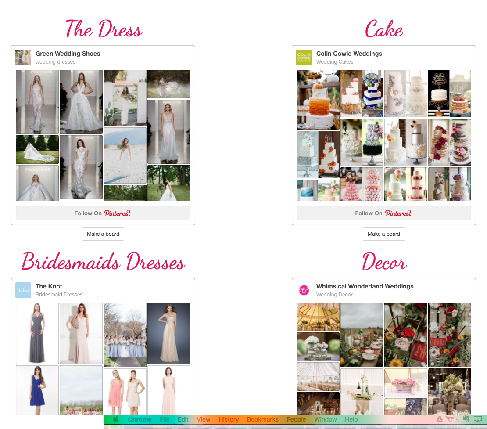

#Bridesmaidal

##A wedding planning application created using the MEAN stack


###This is my personal portfolio created to showcase my projects, share my contact information and give each visitor insight into who I am and what I do. 

Visit here: [Bridesmaidal](http://shirletterly.com/bridesmaidal)

Demo Video: [Project Video](https://youtu.be/AdMFXR0GzNU)

##Built with:
	- Html
	- CSS
	- AngularJS
	- ExpressJS
	- MongoDB
	- NodeJS
	- Google Calendar API
	- Sketch
	- Bootstrap
	- SASS

##Sample Code
###The following code uses the Google Calendar API and creates a method that allows the user to authorize access to their Google calendar as well as create a new calendar inside the application specific to their wedding planning needs.

```javascript
function calendar() {
  var request = gapi.client.calendar.calendars.insert({
      "resource": {
          "summary": "My Wedding", //fix this so that it can be entered from user
          "description": "test",
          "timezone": "xxxx"
      }
  });
  request.execute(function(resp) {
      var events = resp.items;
      console.log(resp.id);
      $http.post(apiPath + '/createCalendar', {
              username: $scope.username,
              calendarID: resp.id,
              token: $cookies.get('token')
          }).then(function successCallback(response) {
              console.log(response);
              if (response.data.message == 'added') {
                  $location.path('/portal');
                  $cookies.put('username', $scope.username);
              }
          }),
          function errorCallback(response) {
              console.log(response);
          }
  });
  return resp.id;
}
```


###The following allows access to the id of the newly created calendar and inserts it into the html that creats the iframe of the new calendar. If the user token is matched in the database, then the id will be inserted successfully.

```javascript
$http.get(apiPath + '/getCalendarID?token' + $cookies.get('token'))
	.then(function successCallback(response) {
	    console.log(response);
	    $scope.calendarID = $sce.trustAsResourceUrl('https://calendar.google.com/calendar/embed?height=600&amp;wkst=1&amp;bgcolor=%23ffccff&amp;' + response.data.calendarID + '&amp;color=%23691426&amp;ctz=America%2FNew_York');

	    if (response.data.message == 'added') {
	        $location.path('/portal');
	        $cookies.put('username', $scope.username);
	    }
	}),
	function errorCallback(response) {
	    console.log(response);
	}
```


####Early stages of site




<!-- add a video of interaction with the site -->

##Future Add-ons
- Add a feature to create a list of vendors with their contact information
- Ability to calculate cost and compare it with the budget.
- Chat capabilities inside the application for the bridal party to stay in touch in one central location.

###Please visit my personal profile to see more current projects.
- [Shirlette Chambers](https://github.com/Shirlazybrat)